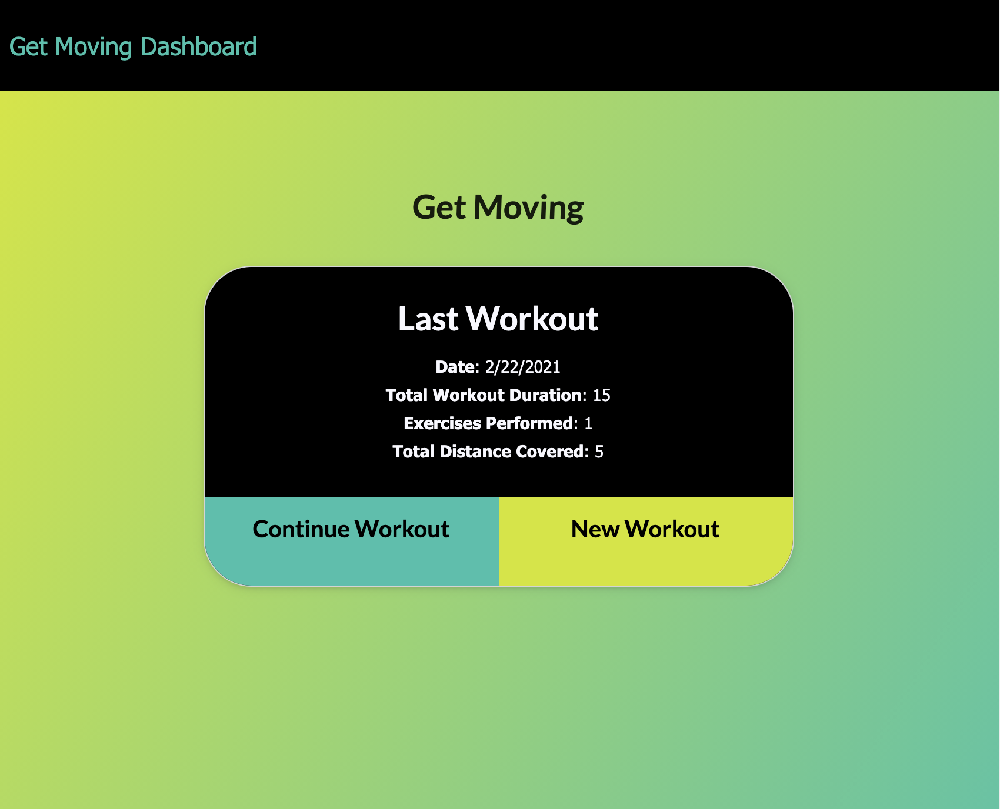
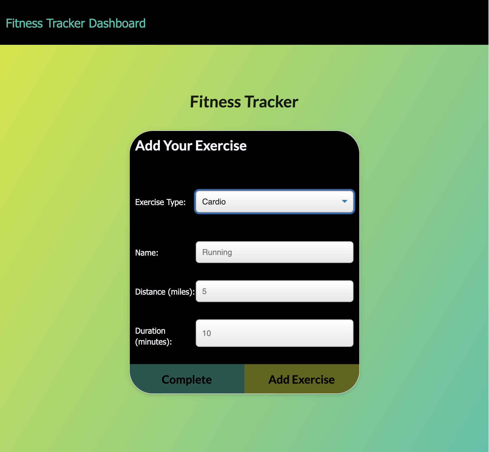
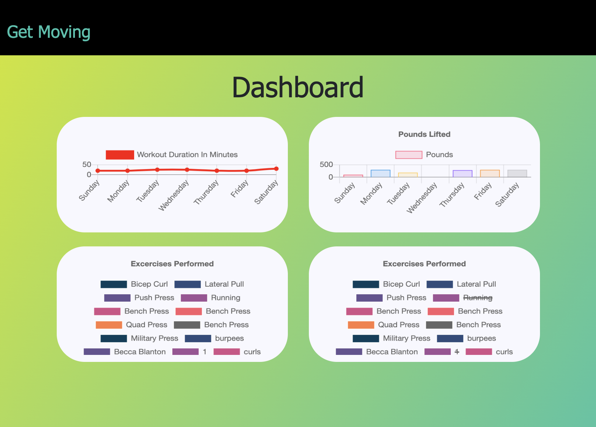

# getmoving

    
## Table of Contents
==================
* [Description](#Description)
* [Technologies](#Technologies)
* [Installation](#Installation)
* [Usage](#Usage) 
* [license](#license) 
* [Questions](#Questions)

==================
    
## Description
Get moving is a web app to track your workouts. Can enter multiple workouts a day. If you enter resistence workout, can track the name, type, weight, sets, reps, and duration of exercise. If the exercise is a cardio exercise, I should be able to track my distance traveled.
    
## Technologies

This app was created primarily with javascript, using express with a mongoDB database using mongoose. 

## Installation
    
no installation needed. go to site using URL here: https://dry-beach-72570.herokuapp.com/
    
## Usage

When going to screen can see last workout. Click create new workouts to enter data about workout, once all fields filled can enter another exercise or click complete. if you go to stats page can see a chart of previous exercises.
### license

This application is covered under the MIT License. Please see any additional files in GitHub for details. 

### Questions

If you have any questions please contact at [beccaablanton@gmail.com](beccaablanton@gmail.com)

[Link to GitHub Profile](https://www.github.com/BeccaBlanton)

### Example

[Link to Deployed Site](https://dry-beach-72570.herokuapp.com/)